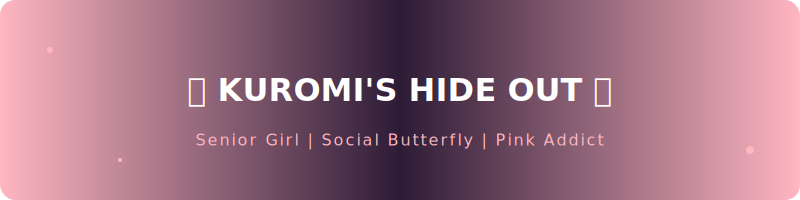

  

   

  

  

### 🖤 Hey there! 我是 Meow 🦋

**一个在粉色和黑色之间反复横跳的...?**

* 🎓 **Status**: 正在享受最后校园时光的准毕业生，主线任务是社交，支线任务是写代码（
* 🎀 **Aesthetic**: 狂热的**库洛米 (Kuromi)** 粉丝！
* 💬 **Social**: 广泛社交爱好者，不仅活跃在 GitHub，也活跃在各种有趣的活动现场。
* 🌈 **Interests**: 喜欢收集各种可爱的盲盒、lzy、研究好看的 UI 排版。

---

### 🍬 My Sweet Stacks

虽然很爱玩，但搞起创作来也是认真的！

  
  
  

---

### 🍭 Daily Stats

  
  

  

---

  <i>"Don't be a basic girl, be a Kuromi girl." 🖤🎀</i>

